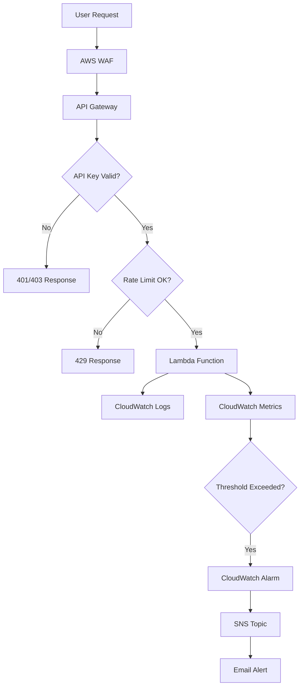

# Design Document - Production Hardening

## Overview

This design document outlines the architecture and implementation approach for hardening the AgenticAI system for production use. The design focuses on security, monitoring, cost control, and operational excellence while maintaining the serverless architecture and staying within AWS free tier limits where possible.

## Architecture

### High-Level Architecture

```
┌─────────────────────────────────────────────────────────────┐
│                     Production Layer                         │
├─────────────────────────────────────────────────────────────┤
│                                                               │
│  ┌──────────┐    ┌──────────┐    ┌──────────┐              │
│  │   WAF    │───▶│API Gateway│───▶│  Lambda  │              │
│  │ (Security)│    │(Auth+Rate│    │ Functions│              │
│  └──────────┘    │  Limit)  │    └──────────┘              │
│                   └──────────┘                                │
│                                                               │
│  ┌──────────────────────────────────────────────┐           │
│  │         CloudWatch Monitoring                 │           │
│  ├──────────────────────────────────────────────┤           │
│  │  • Dashboards  • Alarms  • Logs  • Canaries │           │
│  └──────────────────────────────────────────────┘           │
│                        │                                      │
│                        ▼                                      │
│  ┌──────────────────────────────────────────────┐           │
│  │              SNS Topics                       │           │
│  │  (Email Alerts to Administrators)            │           │
│  └──────────────────────────────────────────────┘           │
│                                                               │
└─────────────────────────────────────────────────────────────┘
```

### Component Interaction



## Components and Interfaces

### 1. API Authentication Layer

**Implementation**: API Gateway API Keys + Usage Plans

**Components**:
- API Keys stored in API Gateway
- Usage Plans defining rate limits and quotas
- Lambda authorizer for custom validation (optional)

**Interface**:
```python
# Request Header
X-API-Key: <api_key_value>

# Response Headers (on success)
X-RateLimit-Limit: 1000
X-RateLimit-Remaining: 999
X-RateLimit-Reset: 1638360000

# Error Responses
401 Unauthorized: Missing API key
403 Forbidden: Invalid API key
429 Too Many Requests: Rate limit exceeded
```

**Configuration**:
```yaml
# SAM Template Addition
ApiKey:
  Type: AWS::ApiGateway::ApiKey
  Properties:
    Name: agenticai-api-key
    Enabled: true

UsagePlan:
  Type: AWS::ApiGateway::UsagePlan
  Properties:
    UsagePlanName: agenticai-usage-plan
    Throttle:
      RateLimit: 1000
      BurstLimit: 2000
    Quota:
      Limit: 1000
      Period: HOUR
```

### 2. CloudWatch Dashboard

**Implementation**: CloudWatch Dashboard with custom widgets

**Metrics Tracked**:
- Lambda: Invocations, Errors, Duration, Throttles, ConcurrentExecutions
- API Gateway: Count, 4XXError, 5XXError, Latency, IntegrationLatency
- DynamoDB: ConsumedReadCapacityUnits, ConsumedWriteCapacityUnits
- SQS: ApproximateNumberOfMessagesVisible, ApproximateAgeOfOldestMessage

**Dashboard Layout**:
```
┌─────────────────────────────────────────────────┐
│           AgenticAI Production Dashboard        │
├─────────────────────────────────────────────────┤
│  API Gateway Metrics    │  Lambda Metrics       │
│  • Request Count        │  • Invocations        │
│  • Error Rate           │  • Error Rate         │
│  • Latency (p50/p95)    │  • Duration (p50/p95) │
├─────────────────────────┼───────────────────────┤
│  DynamoDB Metrics       │  SQS Metrics          │
│  • Read/Write Capacity  │  • Queue Depth        │
│  • Throttled Requests   │  • Message Age        │
└─────────────────────────┴───────────────────────┘
```

**Implementation**:
```python
# scripts/create_dashboard.py
import boto3
import json

def create_dashboard():
    cloudwatch = boto3.client('cloudwatch')
    
    dashboard_body = {
        "widgets": [
            {
                "type": "metric",
                "properties": {
                    "metrics": [
                        ["AWS/ApiGateway", "Count", {"stat": "Sum"}],
                        [".", "4XXError", {"stat": "Sum"}],
                        [".", "5XXError", {"stat": "Sum"}]
                    ],
                    "period": 300,
                    "stat": "Sum",
                    "region": "us-east-1",
                    "title": "API Gateway Requests"
                }
            }
            # ... more widgets
        ]
    }
    
    cloudwatch.put_dashboard(
        DashboardName='AgenticAI-Production',
        DashboardBody=json.dumps(dashboard_body)
    )
```

### 3. CloudWatch Alarms

**Alarm Types**:

1. **Lambda Error Alarm**
   - Metric: Errors
   - Threshold: > 5% error rate over 5 minutes
   - Action: Send SNS notification

2. **API Gateway 5XX Alarm**
   - Metric: 5XXError
   - Threshold: > 10 errors over 5 minutes
   - Action: Send SNS notification

3. **Lambda Duration Alarm**
   - Metric: Duration
   - Threshold: > 10000ms (10 seconds)
   - Action: Send SNS notification

4. **Cost Budget Alarm**
   - Metric: EstimatedCharges
   - Threshold: > $40 (80% of $50 budget)
   - Action: Send SNS notification

**Implementation**:
```yaml
# SAM Template
LambdaErrorAlarm:
  Type: AWS::CloudWatch::Alarm
  Properties:
    AlarmName: agenticai-lambda-errors
    MetricName: Errors
    Namespace: AWS/Lambda
    Statistic: Sum
    Period: 300
    EvaluationPeriods: 1
    Threshold: 5
    ComparisonOperator: GreaterThanThreshold
    AlarmActions:
      - !Ref AlertTopic
```

### 4. SNS Alert Topic

**Implementation**: SNS Topic with email subscription

**Configuration**:
```yaml
AlertTopic:
  Type: AWS::SNS::Topic
  Properties:
    TopicName: agenticai-alerts
    DisplayName: AgenticAI Production Alerts
    Subscription:
      - Endpoint: !Ref AdminEmail
        Protocol: email
```

**Alert Message Format**:
```json
{
  "AlarmName": "agenticai-lambda-errors",
  "AlarmDescription": "Lambda error rate exceeded threshold",
  "NewStateValue": "ALARM",
  "NewStateReason": "Threshold Crossed: 5 errors in 5 minutes",
  "StateChangeTime": "2025-11-28T17:30:00.000Z",
  "Region": "us-east-1",
  "AlarmArn": "arn:aws:cloudwatch:us-east-1:123456789012:alarm:agenticai-lambda-errors"
}
```

### 5. AWS WAF (Web Application Firewall)

**Implementation**: WAF WebACL attached to API Gateway

**Rules**:
1. Rate-based rule: Block IPs exceeding 2000 requests per 5 minutes
2. Geo-blocking: Block requests from high-risk countries (optional)
3. SQL injection protection
4. XSS protection
5. Known bad inputs protection

**Configuration**:
```yaml
WebACL:
  Type: AWS::WAFv2::WebACL
  Properties:
    Name: agenticai-waf
    Scope: REGIONAL
    DefaultAction:
      Allow: {}
    Rules:
      - Name: RateLimitRule
        Priority: 1
        Statement:
          RateBasedStatement:
            Limit: 2000
            AggregateKeyType: IP
        Action:
          Block: {}
```

### 6. Cost Monitoring Script

**Implementation**: Python script using AWS Cost Explorer API

**Features**:
- Display current month spending by service
- Compare to budget
- Show daily cost trend
- Predict end-of-month cost

**Interface**:
```bash
$ python scripts/monitor_costs.py

AgenticAI Cost Report - November 2025
=====================================
Current Spending: $12.45 / $50.00 (24.9%)
Days Remaining: 2

By Service:
  Lambda:      $5.20 (41.8%)
  API Gateway: $3.15 (25.3%)
  DynamoDB:    $2.10 (16.9%)
  S3:          $1.50 (12.0%)
  CloudWatch:  $0.50 (4.0%)

Projected End-of-Month: $18.67
Status: ✓ Within Budget
```

### 7. Backup Configuration

**DynamoDB Point-in-Time Recovery**:
```yaml
DataTable:
  Type: AWS::DynamoDB::Table
  Properties:
    PointInTimeRecoverySpecification:
      PointInTimeRecoveryEnabled: true
```

**S3 Versioning**:
```yaml
CodeBucket:
  Type: AWS::S3::Bucket
  Properties:
    VersioningConfiguration:
      Status: Enabled
    LifecycleConfiguration:
      Rules:
        - Id: DeleteOldVersions
          Status: Enabled
          NoncurrentVersionExpirationInDays: 30
```

### 8. CloudWatch Synthetic Canary

**Implementation**: CloudWatch Synthetics Canary using Node.js

**Test Script**:
```javascript
// canary.js
const synthetics = require('Synthetics');
const https = require('https');

const apiCanary = async function () {
    const apiEndpoint = process.env.API_ENDPOINT;
    const apiKey = process.env.API_KEY;
    
    // Test 1: Health Check
    await synthetics.executeHttpStep('Health Check', {
        hostname: apiEndpoint,
        path: '/health',
        method: 'GET',
        headers: {'X-API-Key': apiKey}
    });
    
    // Test 2: Create Project
    await synthetics.executeHttpStep('Create Project', {
        hostname: apiEndpoint,
        path: '/api/projects',
        method: 'POST',
        headers: {
            'X-API-Key': apiKey,
            'Content-Type': 'application/json'
        },
        body: JSON.stringify({
            name: 'Canary Test',
            type: 'api',
            description: 'Automated test'
        })
    });
};

exports.handler = async () => {
    return await apiCanary();
};
```

## Data Models

### API Key Management

```python
# models/api_key.py
from dataclasses import dataclass
from datetime import datetime
from typing import Optional

@dataclass
class APIKey:
    key_id: str
    key_value: str  # Hashed
    name: str
    created_at: datetime
    last_used: Optional[datetime]
    usage_plan_id: str
    enabled: bool
    rate_limit: int  # requests per hour
    
    def is_valid(self) -> bool:
        return self.enabled
    
    def check_rate_limit(self, current_usage: int) -> bool:
        return current_usage < self.rate_limit
```

### Alert Configuration

```python
# models/alert_config.py
from dataclasses import dataclass
from typing import List
from enum import Enum

class AlertSeverity(Enum):
    INFO = "info"
    WARNING = "warning"
    CRITICAL = "critical"

@dataclass
class AlertConfig:
    alarm_name: str
    metric_name: str
    threshold: float
    evaluation_periods: int
    period_seconds: int
    severity: AlertSeverity
    recipients: List[str]
    enabled: bool
```

## Error Handling

### Authentication Errors

```python
class AuthenticationError(Exception):
    """Raised when API key validation fails"""
    pass

class RateLimitExceededError(Exception):
    """Raised when rate limit is exceeded"""
    pass

# Lambda authorizer
def lambda_handler(event, context):
    try:
        api_key = event['headers'].get('X-API-Key')
        if not api_key:
            raise AuthenticationError("Missing API key")
        
        if not validate_api_key(api_key):
            raise AuthenticationError("Invalid API key")
        
        if not check_rate_limit(api_key):
            raise RateLimitExceededError("Rate limit exceeded")
        
        return generate_policy('Allow', event['methodArn'])
    
    except AuthenticationError as e:
        return generate_policy('Deny', event['methodArn'])
    
    except RateLimitExceededError as e:
        return {
            'statusCode': 429,
            'body': json.dumps({'error': str(e)})
        }
```

### Monitoring Error Handling

```python
# Error handling in monitoring scripts
def create_alarm_with_retry(alarm_config, max_retries=3):
    """Create CloudWatch alarm with retry logic"""
    for attempt in range(max_retries):
        try:
            cloudwatch.put_metric_alarm(**alarm_config)
            logger.info(f"Alarm created: {alarm_config['AlarmName']}")
            return True
        except ClientError as e:
            if attempt == max_retries - 1:
                logger.error(f"Failed to create alarm: {e}")
                raise
            time.sleep(2 ** attempt)  # Exponential backoff
    return False
```

## Testing Strategy

### 1. Authentication Testing

```python
# tests/test_authentication.py
def test_missing_api_key():
    """Test request without API key returns 401"""
    response = requests.get(f"{API_ENDPOINT}/health")
    assert response.status_code == 401

def test_invalid_api_key():
    """Test request with invalid API key returns 403"""
    response = requests.get(
        f"{API_ENDPOINT}/health",
        headers={'X-API-Key': 'invalid-key'}
    )
    assert response.status_code == 403

def test_valid_api_key():
    """Test request with valid API key succeeds"""
    response = requests.get(
        f"{API_ENDPOINT}/health",
        headers={'X-API-Key': VALID_API_KEY}
    )
    assert response.status_code == 200
```

### 2. Rate Limiting Testing

```python
# tests/test_rate_limiting.py
def test_rate_limit_enforcement():
    """Test rate limit is enforced"""
    api_key = create_test_api_key(rate_limit=10)
    
    # Make 10 requests (should succeed)
    for i in range(10):
        response = make_request(api_key)
        assert response.status_code == 200
    
    # 11th request should be rate limited
    response = make_request(api_key)
    assert response.status_code == 429
    assert 'X-RateLimit-Remaining' in response.headers
    assert response.headers['X-RateLimit-Remaining'] == '0'
```

### 3. Alarm Testing

```python
# tests/test_alarms.py
def test_alarm_triggers_on_errors():
    """Test alarm triggers when error threshold is exceeded"""
    # Simulate errors
    for i in range(6):
        trigger_lambda_error()
    
    # Wait for alarm to trigger
    time.sleep(60)
    
    # Check alarm state
    alarm = cloudwatch.describe_alarms(
        AlarmNames=['agenticai-lambda-errors']
    )
    assert alarm['MetricAlarms'][0]['StateValue'] == 'ALARM'
```

### 4. Canary Testing

```python
# tests/test_canary.py
def test_canary_detects_api_failure():
    """Test canary detects when API is down"""
    # Stop API Gateway (in test environment)
    stop_api_gateway()
    
    # Run canary
    result = run_canary()
    
    # Verify canary failed
    assert result['status'] == 'FAILED'
    assert 'Health Check' in result['failed_steps']
```

## Deployment Strategy

### Phase 1: Monitoring Foundation (Week 1)
1. Create CloudWatch dashboard
2. Set up basic alarms (errors, latency)
3. Configure SNS topic and email alerts
4. Deploy cost monitoring script

### Phase 2: Security Hardening (Week 2)
1. Implement API key authentication
2. Configure rate limiting
3. Deploy AWS WAF
4. Enable encryption at rest

### Phase 3: Operational Excellence (Week 3)
1. Enable DynamoDB PITR
2. Enable S3 versioning
3. Create synthetic canaries
4. Document operational procedures

### Phase 4: Automation (Week 4)
1. Set up CI/CD pipeline
2. Automate deployment process
3. Implement automated testing
4. Create rollback procedures

## Security Considerations

1. **API Keys**: Store securely in AWS Secrets Manager, rotate regularly
2. **IAM Roles**: Follow least privilege principle
3. **Encryption**: Enable at rest and in transit
4. **WAF**: Regularly update rules based on threat intelligence
5. **Logging**: Ensure no sensitive data in logs
6. **Access Control**: Use IAM policies to restrict dashboard access

## Performance Considerations

1. **Dashboard**: Limit to essential metrics to reduce costs
2. **Alarms**: Use appropriate evaluation periods to avoid false positives
3. **Canaries**: Run at reasonable intervals (5-15 minutes)
4. **Logging**: Use log sampling for high-volume endpoints
5. **Rate Limiting**: Set limits that balance protection and usability

## Cost Optimization

1. **CloudWatch**: Use metric filters to reduce log ingestion costs
2. **Alarms**: Consolidate related alarms where possible
3. **Canaries**: Run only during business hours if appropriate
4. **Logs**: Set retention periods based on compliance requirements
5. **Dashboards**: Use shared dashboards instead of per-user dashboards

## Maintenance and Operations

### Daily Tasks
- Review dashboard for anomalies
- Check alarm status
- Review cost report

### Weekly Tasks
- Analyze error logs
- Review performance trends
- Check backup status
- Update documentation

### Monthly Tasks
- Review and rotate API keys
- Analyze cost trends
- Update WAF rules
- Review and update alarms
- Conduct disaster recovery drill

## Success Metrics

1. **Availability**: 99.9% uptime
2. **Error Rate**: < 0.1% of requests
3. **Response Time**: p95 < 1 second
4. **Cost**: Stay within $50/month budget
5. **Alert Response**: < 15 minutes to acknowledge
6. **Recovery Time**: < 1 hour for critical issues
